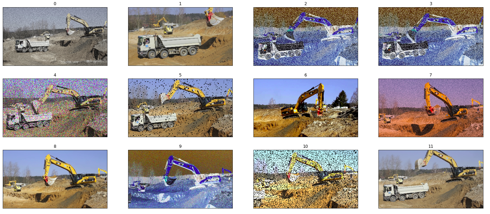

# Object Detection
## Introduction
*TODO* 

#### Requirements 
Please install the following tools:
* docker
* docker-compose
* [nvidia-docker-2](https://github.com/nvidia/nvidia-docker/wiki/Installation-(version-2.0))

Also configure `nvidia-docker` to work with `docker-compose`.

#### Getting the Code
Please clone the repo and `cd` into it.
```
git clone https://github.com/cgarciae/object-detection.git
cd object-detection
```

#### Getting the Data
First create a `data` directory inside the repo's folder. This directory won't be tracked by git. Now, download + extract the data from the google drive folder here and rename the folder to `base`. You should end with a structure like this:
```
+ data
  + base
    + movie1
    + movie2
    ...
```
#### Build container
First build the container to get the environment ready with
```
docker-compose build
```

#### Create Protos
Finally, we have to compile some protobufs that google doesn't include by default. Just execute
```
docker-compose run jupyter bash scripts/create_protos.sh
```

## Data Augmentation
Data augmentation was used with the idea of helping the model to generalize better by broadening the distribution of the data with various types of random filters. The library [imgaug](https://github.com/aleju/imgaug) was used for this purpose. The following augmenter where used:

```python
iaa.Grayscale(alpha=(0.0, 1.0)),
iaa.GaussianBlur(sigma=(0.0, 3.0)),
iaa.AverageBlur(k=(2, 9)),
iaa.MedianBlur(k=(3, 9)),
iaa.Sharpen(alpha=(0.0, 1.0), lightness=(0.75, 2.0)),
iaa.Emboss(alpha=(0.0, 1.0), strength=(0.5, 1.5)),
iaa.Add((-40, 40), per_channel=0.5),
iaa.AddElementwise((-40, 40), per_channel=0.5),
iaa.AdditiveGaussianNoise(scale=0.05*255, per_channel=0.5),
iaa.Multiply((0.5, 1.5), per_channel=0.5),
iaa.MultiplyElementwise((0.5, 1.5), per_channel=0.5),
iaa.Dropout(p=(0, 0.2), per_channel=0.5),
iaa.CoarseDropout(0.05, size_percent=0.1),
iaa.Invert(1.0, per_channel=0.5),
iaa.ContrastNormalization((0.5, 1.5), per_channel=0.5),
iaa.ElasticTransformation(alpha=(0, 5.0), sigma=0.25),
iaa.PiecewiseAffine(scale=(0.01, 0.05)),
```
The resulting randomized images look like this



#### Discussion on Data Augmentation
Data Augmentation generally improves the performace of a model as it forces it to generalize more since it can't depend on any specific details being present in the image but rather it has to abstract more the entities its trying to recognize. However, since we are doing transfer learning with fine tunning by using the last layer of a pretrained model, this layer might already be good enough and data augmentation will have less effect. 

Nevertheless having more data is always better and the variations will still help.

#### Convert base data to tfrecords
```
docker-compose run jupyter python3 src/cli.py create_data training
```

#### Download Model
```
docker-compose run jupyter bash scripts/download_model.sh
```

